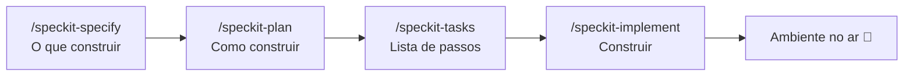

# 🛤️ Golden Path

**Descreva o que você quer. A IA constrói do jeito certo, na primeira vez.**

O Golden Path é um repositório que ensina a IA a criar aplicações com o padrão da casa: mesma stack, mesmas regras, mesmo ambiente. Você não precisa ser desenvolvedor. Conversa em português, aprova cada etapa e vê a aplicação rodando no seu computador.

```text
 💬 Você descreve        📋 A IA especifica       🏗️ A IA planeja        ✅ A IA constrói
 "quero uma lista   →    o que será feito    →    como será feito   →   e sobe tudo no ar
  de tarefas"            (você aprova)            (você aprova)         em http://localhost:3000
```

---

## ✨ Por que existe

| Sem o Golden Path | Com o Golden Path |
|---|---|
| Cada app nasce com uma stack diferente | Stack padrão: React, Node e PostgreSQL |
| "Funciona na minha máquina" | Tudo roda em Docker, igual para todo mundo |
| A IA improvisa e muda de ideia no meio | A IA segue guias e passos escritos pelo time |
| Código antes de entender o pedido | Especificação aprovada antes de qualquer código |
| Medo de apagar o banco sem querer | Comandos perigosos exigem confirmação explícita |

---

## 🚀 Começando em 3 minutos

**Você precisa de:** [Docker Desktop](https://www.docker.com/products/docker-desktop/) instalado e aberto, e o [Claude Code](https://docs.anthropic.com/en/docs/claude-code/setup).

1. Abra este projeto no Claude Code.
2. Digite `/subir-ambiente`.
3. Acesse a tela em **http://localhost:3000** e a API em **http://localhost:4000/health/ready**.

Para desligar sem perder os dados: `/parar-ambiente`.

---

## 🧭 Como criar algo novo

Toda aplicação ou funcionalidade nova passa pelo **Spec Kit**, na ordem abaixo. Você aprova cada etapa antes de a IA seguir.



Você não precisa decorar os comandos: se não digitar nenhum, a IA conduz o fluxo sozinha. Detalhes em [SPECKIT.md](SPECKIT.md).

Só correções pequenas (um texto, uma cor, um bug simples) podem ser pedidas direto.

---

## 🧱 O que vem de fábrica

```text
golden-path/
├── frontend/react/      Tela: React + Vite + Tailwind
├── backend/node/        API: Node.js + TypeScript + Prisma (há também guia para Python, sem esqueleto)
├── database/postgres/   Banco: PostgreSQL com migrations
├── infrastructure/docker/  Docker Compose e guias de ambiente
├── templates/           Cópias dos modelos (geradas; não edite)
├── scripts/             Verificações e sincronização dos templates
├── specs/               Especificações de cada funcionalidade
└── .specify/            Regras do projeto (constituição) e Spec Kit
```

Cada pasta traz um **guia** (as regras daquela tecnologia) e **skills** (o passo a passo de cada tarefa). A IA lê só o que o pedido exige.

| Quero... | A IA abre |
|---|---|
| Uma tela | [frontend/FRONTEND.MD](frontend/FRONTEND.MD) |
| Um endpoint | [backend/BACKEND.md](backend/BACKEND.md) |
| Uma tabela | [database/DATABASE.md](database/DATABASE.md) |
| Rodar o ambiente | [infrastructure/docker/DOCKER.md](infrastructure/docker/DOCKER.md) |

---

## 🛡️ Regras que protegem você

As regras ficam na [constituição do projeto](.specify/memory/constitution.md). As principais:

- **Spec Kit obrigatório** para app e funcionalidade nova.
- **Tudo em Docker**: nada para instalar além do Docker Desktop. As portas só aceitam conexões do seu computador.
- **Banco só muda por migration**, nunca na mão.
- **Dados protegidos**: `docker compose down -v` e similares só rodam com sua confirmação.
- **Segredos fora do git**: senhas ficam no `.env`, que nunca é versionado.
- **Linguagem simples**: a IA explica sem jargão e executa os comandos por você.

---

## 🔧 Algo deu errado?

| Sintoma | O que fazer |
|---|---|
| "Docker não está rodando" | Abra o Docker Desktop e aguarde ~30s |
| Porta ocupada | Mude `WEB_PORT`, `API_PORT` ou `POSTGRES_PORT` no `.env` |
| Tela em branco | Peça à IA: "veja os logs do serviço `web`" |

Na dúvida, descreva o problema para a IA. Ela sabe diagnosticar o ambiente.

---

## 🤝 Contribuindo

Antes de abrir PR, rode `scripts/check-repo.sh` (a CI roda o mesmo e sobe o ambiente de verdade). Quer ensinar um novo padrão? Adicione um guia e uma skill na pasta da tecnologia e registre no [AGENTS.md](AGENTS.md). Mudanças nas regras gerais passam pela [constituição](.specify/memory/constitution.md).
